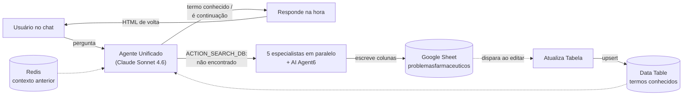

# Motor do Balconista Pro

Documentação dos 8 fluxos n8n que sustentam o chat, o login e a base de
conhecimento farmacêutica do Balconista Pro IA. Hospedados na **ORAQLE
VPS** (`chat-n8n-main.wcvao0.easypanel.host`), migrados do servidor
antigo da Tella Marketing (`n8n.tellamarketing.com.br`) em agosto de
2026.

> Levantado direto do estado real dos workflows via API do n8n — não é
> a documentação que os fluxos deveriam ter, é a que eles têm.

**Números:** 8 fluxos · 2 pontos de entrada · 5 agentes especialistas ·
3 camadas de dados · 99 problemas na base · 2 provedores de IA.

---

## 1. Como as peças se encaixam

O site chama dois webhooks — um pra login, um pro chat. O chat é o
coração do sistema: um agente de triagem decide, a cada mensagem, se
responde na hora com o que já sabe ou se precisa acionar um enxame de
agentes especialistas pra gerar conhecimento novo e guardá-lo pra
próxima vez.

O Agente Unificado decide entre dois caminhos a cada mensagem: se o
termo já está mapeado, responde na hora usando o cache da Data Table.
Se não encontra, aciona 5 especialistas em paralelo que escrevem cada
um suas colunas na planilha — que por sua vez realimenta a Data Table
via o fluxo Atualiza Tabela, fechando o ciclo para a próxima pergunta
igual.

---

## 2. Login (Auth)

Webhook `/webhook/login-auth`, chamado pelo `script.js` do site.
Autentica sem senha própria: o campo "senha" é validado contra o
telefone de cobrança cadastrado na planilha, e cada conta pode ter até
5 dispositivos vinculados.

### Lógica ativa (8 nós)

1. Busca a linha da planilha pelo `email` recebido
2. Compara `password` enviado com a coluna `Telefone cobrança` —
   diferente, retorna erro de senha
3. Verifica se o `deviceId` do navegador já está na lista de
   dispositivos conhecidos
4. Se já existe → libera acesso imediatamente
5. Se é dispositivo novo → checa se já tem menos de 5 registrados;
   libera e registra, ou bloqueia com erro de limite

### Achado

⚠️ **21 dos 30 nós do fluxo estão mortos** — são três versões
anteriores dessa mesma lógica (buscas, checagens de senha e de limite
duplicadas) que ficaram no canvas, desconectadas do webhook ativo. Não
afetam a produção, mas seguram a leitura do fluxo pra qualquer um que
abrir depois. Candidato natural a uma limpeza.

---

## 3. Plataforma (Chat)

Webhook de Chat Trigger `74f5eb0b-4919-4bc3-99fb-5d9fce85ff9f/chat`,
chamado pelo `chat-script.js`. É o fluxo mais complexo dos 8 —
orquestra tudo: memória de conversa, decisão de rota, análise de
imagem e o disparo do enxame de especialistas.

### O agente de triagem

O **Agente Unificado** (Claude Sonnet 4.6) recebe a mensagem, o
histórico do Redis e a tabela de termos conhecidos, e se enquadra em
um de três perfis a cada rodada:

| Perfil | Quando | Ação |
|---|---|---|
| **1 — Sintoma** | Queixa/dor/doença nova | Casa contra a tabela de termos; responde `ACTION_SEARCH_DB: TERMO` ou `ACTION_SEARCH_DB: não encontrado` |
| **2 — Visual** | Imagem anexada | Analisa a imagem diretamente (o próprio Claude é multimodal) e classifica receita médica vs. embalagem de produto |
| **3 — Continuação** | Dúvida sobre resposta anterior | Responde usando o contexto do Redis, sem acionar o banco |

### O gatilho do enxame

Quando a saída começa com `ACTION_SEARCH_DB:` e contém "não
encontrado", o fluxo limpa o termo (regex extrai o conteúdo entre
parênteses) e dispara, em paralelo, os 5 webhooks especialistas mais o
`AI Agent6` interno — cada um grava suas próprias colunas na mesma
linha da planilha (upsert por `Problema`). Se o termo já foi mapeado
mas não veio com "não encontrado", o fluxo pula direto pra
`Get row(s)` na Data Table.

### Achados

⚠️ **5 nós desconectados**: três chamadas ao Google Custom Search
(desabilitadas), um node `Analyze an image` via Gemini Vision que não
é mais usado — o Claude do Agente Unificado já analisa imagem
nativamente — e um par `Webhook1` / `Respond to Webhook` de uma versão
anterior do fluxo, hoje sem downstream.

---

## 4. Os 5 especialistas

Cada um recebe o mesmo `problema_limpo` e devolve HTML pronto pra
colunas específicas da planilha — nenhum sabe da existência dos
outros, o paralelismo é inteiro coordenado pelo Plataforma (Chat).

| Fluxo | Webhook | Escreve | Modelo | Status |
|---|---|---|---|---|
| **Clínico** | `/webhook/clinico` | `Palavras similares / termos populares` — vocabulário leigo que alimenta o casamento de termos | OpenAI | ativo |
| **Conduta** | `/webhook/conduta` | `Conduta de balcão` — raciocínio clínico, causas prováveis, alerta de encaminhamento | OpenAI | ativo |
| **BPS** | `/webhook/bps` *(tool "indicacao")* | `BPS` — 6 a 8 perguntas de triagem | Claude | ativo |
| **Segurança** | `/webhook/seguranca` | `Observações ou alertas clínicos` — sinais de alarme | Claude | ativo |
| **Operacional** | `/webhook/operacional` | `indicacaoperfumaria` (upsell ético) + `msgposvenda` (WhatsApp pós-venda) | Claude | ativo |
| **AI Agent6** | interno ao Plataforma (Chat), não é webhook separado | `Problema` + `Indicação de tratamento` | OpenAI | ativo |

ℹ️ **Migração de modelo pela metade:** Segurança, Operacional e BPS já
rodam em Claude; Clínico, Conduta e o AI Agent6 interno ainda estão em
OpenAI. Os três que migraram carregam um node `OpenAI Chat Model6`
órfão, sobrando da troca.

---

## 5. Atualiza Tabela

O fluxo mais simples dos 8 — só 2 nós — e o elo que fecha o ciclo
entre a planilha (editável por humano) e a Data Table (cache rápido
que os outros fluxos consultam).

| | |
|---|---|
| **Gatilho** | Google Sheets Trigger — dispara a cada edição na planilha `problemasfarmaceuticos` |
| **Ação** | `Upsert row(s)` na Data Table `problemas_farm`, casando por `problema`, todas as 16 colunas |
| **Estado atual** | 99 linhas sincronizadas |

⚠️ Editar um nó desse fluxo direto no editor sem salvar pode reverter
pra uma versão em cache no navegador — já aconteceu uma vez durante a
migração e desfez o remapeamento da Data Table. Se for mexer, atualize
a aba antes.

---

## 6. Camadas de dados

Três armazenamentos com papéis bem separados — nenhum deles migra
sozinho ao exportar/importar um workflow, foi preciso recriar os três
na VPS nova.

| Camada | Papel | Quem escreve | Quem lê |
|---|---|---|---|
| **Google Sheet** `problemasfarmaceuticos` | Fonte da verdade, editável por humano | Os 5 especialistas + AI Agent6 | Atualiza Tabela |
| **Data Table** `problemas_farm` (16 colunas) | Cache rápido nativo do n8n, escopo por projeto | Atualiza Tabela | Agente Unificado (`Get row(s)` ×2) |
| **Redis** | Memória de conversa por sessão | Plataforma (Chat) a cada resposta | Agente Unificado, a cada nova mensagem |

---

## 7. Infraestrutura

| Instância | Papel | URL |
|---|---|---|
| n8n antigo | Origem (Tella Marketing) — hoje só leitura/backup | `n8n.tellamarketing.com.br` |
| n8n novo | Produção — onde o site aponta hoje | `chat-n8n-main.wcvao0.easypanel.host` |

### Credenciais em uso (n8n novo)

| Credencial | Tipo | Origem |
|---|---|---|
| Balconista - Redis | `redis` | Criada na migração |
| Balconista - Google Gemini | `googlePalmApi` | Criada na migração |
| Google Sheets account | `googleSheetsOAuth2Api` | Criada na migração |
| Google Sheets Trigger account | `googleSheetsTriggerOAuth2Api` | Criada na migração |
| OpenAI account | `openAiApi` | Reaproveitada — compartilhada com o resto da TecVancel |
| Anthropic account | `anthropicApi` | Já existia na VPS, reaproveitada pela migração de modelo em andamento |

URLs e chaves de API das duas instâncias estão salvas em `.env` na raiz
do projeto (fora do Git — ver `.gitignore`).

---

## 8. Achados

Nada aqui quebra produção — são pontos que valem uma decisão
consciente, não corrigidos de graça nesta rodada.

1. **21 nós mortos no Login (Auth)** — três iterações antigas da mesma
   lógica de login empilhadas no canvas, desconectadas do webhook
   ativo.
2. **5 nós desconectados no Plataforma (Chat)** — Google Custom Search
   desabilitado (×3), análise de imagem via Gemini órfã, e um
   webhook/respond legado sem downstream.
3. **Migração OpenAI → Claude pela metade** — Segurança, Operacional e
   BPS já usam Claude; Clínico, Conduta e o AI Agent6 interno seguem
   em OpenAI — modelos órfãos sobrando nos três primeiros.
4. **Credencial OpenAI compartilhada** — os fluxos ainda em OpenAI
   usam a conta já existente na VPS, mesma usada pelos fluxos de
   Instagram/carrossel da TecVancel — billing não está separado por
   cliente.
5. **8 colunas da planilha sem gerador ativo** — `introducao`,
   `sintomas`, `causas`, `cuidado`, `interac`, `etiq`, `bilhete`,
   `checklist` existem na Data Table mas nenhum dos 6 agentes atuais
   as preenche — populadas manualmente ou legado de uma versão
   anterior do produto.
